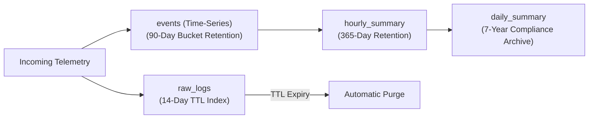

# SentinelDB Horizontal Scalability & Production Operations

This document defines the operational architecture for scaling SentinelDB across enterprise multi-cluster environments handling tens of thousands of sustained events per second.

---

## 1. Sharding Strategy & Shard Key Selection

MongoDB 7 supports sharding for both time-series and regular collections. Selecting the correct shard key prevents hot-spotting on write operations and guarantees efficient targeted queries.

### Sharding the `events` Collection (Time-Series)

In MongoDB time-series collections, sharding is executed on the underlying bucket collections. The shard key must incorporate fields from the `metaField` and optionally the `timeField`.

#### Recommended Shard Key:
```javascript
sh.shardCollection("sentineldb.events", { "meta.host": 1, "ts": 1 })
```

#### Technical Rationale:
1. **Even Write Distribution**: With ~120+ internal enterprise hosts and perimeter gateways generating telemetry concurrently, hashing or range-partitioning on `meta.host` guarantees write traffic is dispersed across all available shards. No single shard absorbs all ingest writes.
2. **Scatter-Gather Prevention**: High-frequency queries (e.g. searching events from a compromised host `meta.host="nwl-app-04"` over a time window) are targeted to a single shard, bypassing expensive cluster-wide scatter-gather operations.
3. **Compound Ordering**: Suffixing the key with `"ts": 1` ensures chunks within a given host are partitioned chronologically, making range drop operations or archival tiering efficient.

> [!CAUTION]
> **Anti-Pattern Warning**: Never shard solely on `{ "ts": 1 }`. Sharding on a monotonically increasing timestamp directs 100% of write throughput to the single shard holding the maximum chunk range, creating an acute write bottleneck.

---

### Sharding the Supporting Collections

| Collection | Recommended Shard Key | Rationale |
|---|---|---|
| `raw_logs` | `{ "host": "hashed", "ts": 1 }` | Hashing the hostname achieves uniform chunk distribution across shards while avoiding timestamp write hotspots. |
| `ip_state` | `{ "_id": "hashed" }` | `_id` is the source IP address. Hashing ensures atomic upsert deltas distribute evenly without contention. |
| `connections` | `{ "srcHost": 1 }` | Critical for `$graphLookup`: routing edges by source host ensures recursive lookups on `connectToField: "srcHost"` remain local to a shard or minimal shards. |
| `alerts` | `{ "status": 1, "ts": 1 }` | Keeps active open alerts easily accessible on active nodes. |

---

## 2. Replication & High Availability

In production, SentinelDB deploys a **3-node minimum replica set** per shard:
- **Primary**: Accepts all write operations (ingestion batches, alert creations, incident modifications).
- **Secondary (Data-bearing)**: Asynchronously replicates the WiredTiger journal and oplog. Serves read-heavy analyst dashboard queries when configured with `ReadPreference.SECONDARY_PREFERRED`.
- **Secondary (Analytics / Backup)**: Can be tagged with custom replica set tags for reporting pipelines (`$merge`), preventing analytics batch jobs from competing with write lock latency on the primary.

### Write Concern & Read Concern Policy
- **Telemetry Ingestion**: `WriteConcern(w=1, j=False)` for high-throughput raw telemetry. Occasional dropped packets in transit are acceptable in exchange for 20,000+ ev/s ingest speeds.
- **Alert Creation & Incidents**: `WriteConcern(w="majority", j=True)` with `ReadConcern.MAJORITY` to prevent phantom alerts or rolled-back containment tickets during unexpected primary failovers.

---

## 3. Data Retention Lifecycle & Cold Tiering

Security regulations (PCI-DSS, ISO 27001, SOC 2) mandate distinct retention windows for unparsed raw logs versus aggregated compliance summaries.



1. **Hot Tier (0 – 14 Days)**:
   - Full-text searchable logs stored in `raw_logs`.
   - Purged automatically at zero compute cost using MongoDB's background TTL index thread:
     ```javascript
     db.raw_logs.createIndex({ "ts": 1 }, { expireAfterSeconds: 1209600 })
     ```
2. **Warm Tier (14 – 90 Days)**:
   - Compressed structured telemetry in `events` (time-series).
   - Columnar compression minimizes disk usage.
3. **Cold / Rollup Tier (90 Days – 7 Years)**:
   - Precomputed metrics in `hourly_summary` and `daily_summary` generated via Pipeline 9 `$merge`.
   - Data can be exported to S3/GCS parquet files via MongoDB Atlas Online Archive or periodic analytical exports for long-term historical audits.

---

## 4. Production Ingestion Architecture

In production, log shippers stream directly into a distributed message broker before entering MongoDB:

```
[Endpoints / Firewalls] 
      │ (Syslog, Beats, Sysmon)
      ▼
 [Kafka Broker: topics (auth, fw, web)]
      │
      ├───────────────────────────────┐
      ▼                               ▼
[MongoDB Kafka Sink Connector]  [Stream Enrichment Worker]
  • events (batch unordered)       • computes rolling IP delta
  • raw_logs (batch unordered)     • upserts ip_state
                                   • feeds Change Stream detector
```

1. **Kafka Partitioning**:
   - Telemetry is partitioned by `srcIp` or `host` ensuring events from the same asset are delivered in strict chronological order to consumers.
2. **Consumer Parallelism**:
   - Multiple worker instances consume distinct Kafka partitions and issue parallel `bulk_write(ordered=False)` commands to MongoDB.
3. **Buffer Management**:
   - The message buffer absorbs transient database maintenance windows (e.g. replica set step-downs) without data loss.
